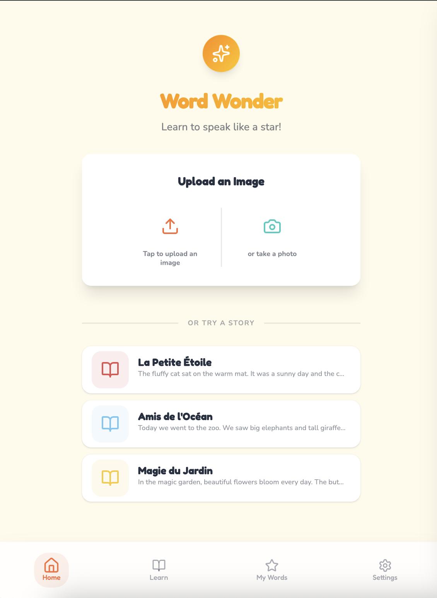

# Word Wonder 🌟

**Word Wonder** is an AI-powered interactive learning application designed to help children (and learners of all ages) improve their reading and pronunciation skills. By combining advanced AI, Text-to-Speech, and Speech Recognition, it brings stories and words to life.



## ✨ Key Features

- **📖 Interactive Reading:**
  - Import stories via **Camera (OCR)** or manual text entry.
  - Click any word to get a child-friendly definition and visual illustration.
  
- **🤖 Powered by AI (Google Gemini):**
  - Generates context-aware definitions for specific words.
  - Creates custom illustrations for words on demand.
  
- **🗣️ Pronunciation Practice:**
  - **Text-to-Speech (TTS):** Listen to how words and sentences should sound.
  - **Speech-to-Text (STT):** Read aloud and get instant feedback on your pronunciation.
  
- **🎨 Engaging UI:**
  - Bright, kid-friendly design using **DaisyUI** & **TailwindCSS**.
  - Fun animations and interactive elements.
  
- **🌍 Internationalization:**
  - Supports multiple interface languages (English, French, Arabic, etc.).

## 🛠️ Technology Stack

- **Framework:** [Angular 21](https://angular.dev/) (Standalone Components, Signals, Zoneless)
- **Styling:** [TailwindCSS v4](https://tailwindcss.com/) & [DaisyUI v5](https://daisyui.com/)
- **AI & ML:** 
  - [Google Gemini API](https://ai.google.dev/) (Content & Image Generation)
  - Browser Native Speech APIs (Synthesis & Recognition)
- **Icons:** [Lucide Angular](https://lucide.dev/)
- **State Management:** Angular Signals & NGRX Signals
- **Deployment:** Vercel

## 🚀 Getting Started

### Prerequisites

- Node.js (Latest LTS recommended)
- pnpm (recommended) or npm
- API Keys for:
  - **Google Gemini** (Vertex AI or AI Studio)
  - **Pexels** (for image search)

### Installation

1.  **Clone the repository:**
    ```bash
    git clone https://github.com/your-username/word-wonder.git
    cd word-wonder
    ```

2.  **Install dependencies:**
    ```bash
    pnpm install
    ```

3.  **Setup Environment Variables:**
    Create a `.env` file in the root directory:
    ```bash
    GOOGLE_CLOUD_API_KEY=your_gemini_key_here
    PEXELS_API_KEY=your_pexels_key_here
    ```

4.  **Run the application:**
    ```bash
    pnpm start
    ```
    Navigate to `http://localhost:4200`.

## 🤝 Contributing

1.  Fork the Project
2.  Create your Feature Branch (`git checkout -b feature/AmazingFeature`)
3.  Commit your Changes (`git commit -m 'Add some AmazingFeature'`)
4.  Push to the Branch (`git push origin feature/AmazingFeature`)
5.  Open a Pull Request

## 📄 License

All rights reserved.

---
Built with ❤️ for eager learners.
